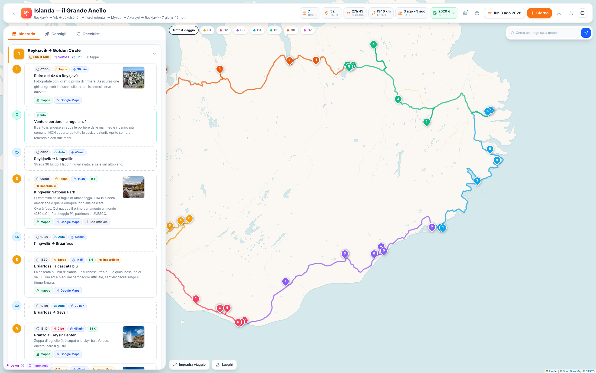

# Trip Planner

[](LICENSE)
[](https://react.dev)
[](https://vite.dev)
[](https://tailwindcss.com)
[](#tech-stack)

A polished, fully client-side road-trip planner. Build day-by-day itineraries with a drag-and-drop timeline, see the whole route as one continuous loop on an interactive map, track your budget per category, and get Google-Maps-style directions — all powered exclusively by **free APIs**, with no accounts and no keys.

Ships pre-loaded with a real 7-day / 6-night California loop (Pasadena → Big Sur → San Francisco → Yosemite → Sequoia → Pasadena), complete with timings, drive legs, nightly hotels, entry fees, practical warnings and official booking links.



## Features

### AI travel assistant — Ulisse
- **Agent-built trips** — a new trip starts as a full-screen conversation: Ulisse interviews you **one interactive question card at a time** (single choice, multi choice or free text), confirms a brief, then **researches online and builds the entire itinerary live** — a progress stepper shows each phase while days, stops, transfers and hotels appear in real time, ending with a summary and concrete improvement proposals. Anti-hallucination rules: coordinates only from geocoding, transfer durations from real routing, opening hours/prices verified via web search with cited sources.
- **A live notebook** — Ulisse takes structured notes after every single answer (enforced at the tool layer, not just prompted) and the notebook card fills in next to the chat in real time; it is re-injected on every turn as persistent per-trip memory, for both engines.
- **Multi-modal transport** — every transfer has a mode (car, walk, bus, train, plane, ferry) with its own icon; car/bus legs follow real roads, walking uses pedestrian routing, trains/flights/ferries are drawn as dashed lines; the fuel estimate only appears when a car is involved.
- **In-app chat** (floating panel over the map on desktop, its own tab on mobile) with **two subscription-powered engines**: Claude (Agent SDK, Pro/Max login) and **Codex** (OpenAI Codex CLI, ChatGPT sign-in). No API keys. A custom system prompt turns them into travel-planning experts, restricted to 20+ purpose-built trip tools plus web search for fresh info (no file or shell access).
- **One-click guided sign-in** — if an engine isn't connected, the chat shows a card with a single button: the local server runs the CLI login for you (the browser consent page opens by itself; Claude additionally asks to paste back a one-time code) and your message is retried automatically on success. A terminal fallback stays available.
- **Model lists that never go stale** — the ChatGPT model picker mirrors the Codex CLI's own model cache (stale saved choices self-heal), while Claude's aliases (Sonnet/Opus/Haiku) always resolve to the newest model of each family — the picker shows the exact model id currently behind the alias.
- The agent can read the whole trip, **add / edit / move / remove activities and days**, set dates and budgets, search real places (never inventing coordinates), toggle curated suggestions, and place new stops at the **route-optimal position**.
- Every tool call is executed **in the browser against the live store**, so each edit appears instantly in the timeline (with a highlight flash). The per-turn review panel lists **every single change with a field-level diff and a mini route-map preview**, each individually revertible — or undo the whole turn at once.
- **Conversations are saved per trip** and can be reopened later with their full agent context (session resume), streamed token-by-token with markdown and photo carousels in replies.
- Architecture: a small local Node server (`server/`) bridges both engines to the open tab over WebSocket; the browser stays the source of truth. The same 18 tools are also exposed as a standard **MCP server over HTTP** (`/mcp`) — Codex consumes it today, and any MCP client (Claude Desktop, ChatGPT connectors) can use it tomorrow.

### Itinerary
- **Multi-trip dashboard** — create, duplicate, delete and import trips; each card shows a cover photo, dates, stop count and estimated distance and budget.
- **Day-by-day timeline** with five activity types (stop, drive, food, hotel, info), times, durations, notes, multiple links, must-see flags and check-off during the trip.
- **Smooth drag & drop** to reorder activities, including across days (dnd-kit).
- **Calendar-aware days** — pick a start date in a custom calendar popover that highlights the whole trip span; every day card shows its real date.
- **Pre-trip checklist** with progress bar, seeded with the critical bookings and road-condition checks.

### Map
- **One continuous round trip** — every day's leg starts where the previous one ended and the loop closes back at the origin, drawn on **real roads** (OSRM routing, cached locally) and color-coded per day with numbered pins.
- **Place search** (Nominatim) with one-click *"Add to trip"* that inserts the stop **at the route-optimal position** — the gap that adds the fewest extra kilometres.
- **Directions like Google Maps** — pick A and B by search, by clicking the map, or from any trip pin: blue route overlay, duration, distance and localized turn-by-turn steps, in a panel that expands with a smooth animation.
- **Clickable route legs** — click any leg (solid or dashed) for a popup with the transport mode, day, endpoints, real distance and estimated duration, plus a *"show in itinerary"* jump that highlights the matching entry.
- Per-day filtering, fly-to from any activity, and deep links into the real Google Maps for navigation.

### Budget
- **Cost field on every activity** (nightly price on hotels, tickets/parking/tolls elsewhere), with a chip on each card.
- **Budget badge** in the header showing the grand total; hover or click reveals a breakdown by category — hotels, food, activities, extras and an **automatic fuel estimate** computed from the real road distance and your car's settings.
- **Your car, for real** — set make and model (a photo of the car appears via Wikipedia), consumption, and the pump price **in the local unit** ($/gal, $/L or €/L with a daily-refreshed EUR/USD rate); one button asks Ulisse to research the current average fuel price at the destination and fill everything in.

### Photos
- **Automatic imagery** — every located stop shows photos of the nearest Wikipedia articles (free geosearch API, lazily fetched and cached), browsable in a **carousel** inside each activity's detail card.
- **Personal galleries** — drag & drop photos from your computer into the editor (compressed client-side, stored in IndexedDB), add by URL, remove, pick the cover, or opt out of the automatic photos per activity.

### Suggestions
- A per-trip catalog of extra stops with photos, notes and links — Ulisse fills it with the good ideas that didn't make the itinerary. A single toggle inserts each one **automatically at the optimal point of the route** (with the estimated detour in km) — and removes it just as cleanly.

### Sharing
- **Export / import JSON** — your own photos are inlined into the export, so the file you send carries everything. Data persists locally (localStorage + IndexedDB); nothing ever leaves the browser.


## Tech stack

| | |
|---|---|
| UI | React 19 · Tailwind CSS 4 · lucide-react |
| State | zustand (persisted, versioned migrations) |
| Map | Leaflet / react-leaflet · CARTO Voyager tiles |
| Drag & drop | dnd-kit |
| Build | Vite |

**Free services used at runtime** (no keys, no accounts): OpenStreetMap/CARTO tiles, [Nominatim](https://nominatim.org) geocoding, [OSRM](http://project-osrm.org) routing & directions, Wikipedia geosearch for imagery. All responses are cached client-side to stay polite with the public endpoints.

## Getting started

```sh
npm install
npm run dev      # web app (http://localhost:5199) + AI agent server together
npm run build    # production build in dist/
```

On macOS you can also double-click `Avvia Trip Planner.command`, which serves the production build, starts the agent server and opens the browser.

**AI assistant prerequisites**: a [Claude Code](https://claude.com/claude-code) install for the Claude engine and/or a ChatGPT account for Codex (the project pins its own Codex CLI via npm). You don't need the terminal: the first time an engine isn't connected the chat offers a **one-click guided sign-in** that drives the CLI login for you. The agent server reuses those local logins — a personal, self-hosted setup; usage counts against your plans' limits. Without them, the whole app works normally and the chat reports what's missing.

Ports are configurable: `AGENT_PORT` for the agent server, `VITE_AGENT_PORT` to point the web app at it (both default to 5200).

## Project structure

```
src/
  App.jsx                  layout, tabs, overlays
  store.js                 zustand stores: trips (persisted + migrations), routes, UI
  data/
    seed.json              the pre-loaded California itinerary (incl. its suggestions)
  lib/
    utils.js               dates, durations, costs, fuel units, trip normalization
    geo.js                 haversine, optimal insertion, OSRM routing & turn-by-turn
    imgdb.js               IndexedDB photo store, compression, portable export
    fx.js                  daily-cached EUR/USD rate for fuel prices
  agent/
    socket.js              WebSocket client, chat store, saved chats, guided auth
    toolExecutors.js       agent tools executed against the live store, per-edit undo
  components/
    Dashboard.jsx          multi-trip home
    Header.jsx             title, stats, budget breakdown, car settings, export/import
    ItineraryPanel.jsx     day list + cross-day drag & drop
    DayCard.jsx            day header + timeline
    ItemCard.jsx           activity card with chips, links, photo thumb
    ItemDetail.jsx         detail card with photo carousel
    ItemEditor.jsx         full editor: gallery, cost, links, location search
    DayEditor.jsx          day title, night stop, color
    MapPanel.jsx           map, road routes, place search, directions
    Suggestions.jsx        toggleable curated stops
    Checklist.jsx          pre-trip checklist
    DatePicker.jsx         calendar popover with trip-range highlight
    ItemImage.jsx          Wikipedia + personal photo resolution
    InterviewView.jsx      full-screen interview with gliding composer + live notebook
    QuestionCard.jsx       interactive one-question-at-a-time answer cards
    ChatPanel.jsx          in-app agent chat (stream, edits review, saved chats)
    chatShared.jsx         tool chips, model picker, guided sign-in cards
server/
  index.mjs                local agent server (WebSocket + MCP over HTTP)
  agent.mjs                Claude Agent SDK + Codex CLI engines, dynamic models
  auth.mjs                 guided in-app sign-in flows for both engines
  bridge.mjs               browser bridge: tool calls in, live edits out
  tools.mjs                shared tool definitions (SDK + MCP)
  prompts/                 persona, interview and planning rules
```

## Notes

- The itinerary and all edits live entirely in your browser. Use **Export** for backups or to share a trip; the recipient imports the file and sees exactly your plan, photos included.
- Road distances and the fuel estimate refine themselves progressively as OSRM answers; straight dashed lines are shown as a fallback if routing is unavailable.

## Support

If this project is useful to you, consider supporting its development:

- ☕ [Buy Me a Coffee](https://buymeacoffee.com/prot10)
- 💛 [PayPal](https://paypal.me/andreaprotani99)

## License

This project is licensed under the **GNU Affero General Public License v3.0** — see [LICENSE](LICENSE).

In short: you are free to use, study, modify and share it, but any distributed or network-served derivative **must remain open source under the same license**. This deliberately prevents closed-source commercial repackaging.
